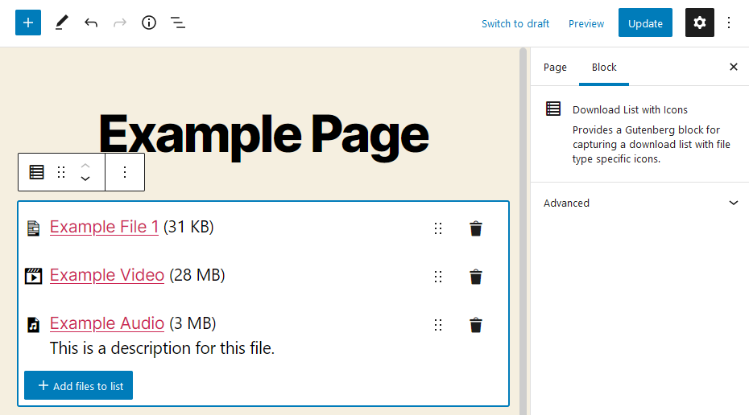

# Use the plugin "Download List Block with Icons"

This plugin adds a Block for Block Editor to manage a download list with file type specific icons. No configuration is necessary.

## Use the download list

1. Go to “Create new page” under "Pages" in the WordPress backend
2. Add the "Download List Block with Icons" block there.
3. You will see a button where you can open your media library and choose which files you want to use for this list.
4. You can sort the files by its date or title on the options above the list.
5. On the sidebar on the right you can set how the list should be presented in frontend.

## Screenshots

